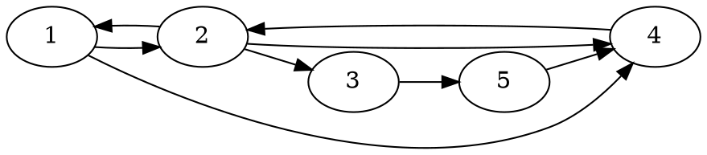
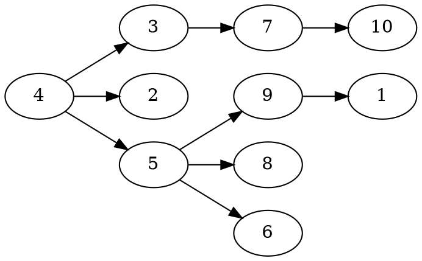

## R 條條大路通羅馬 
:::info
條條大路通羅馬，有$N$個城市$M$條道路，$M$條道路是有方向性的。
:::

<!---
```
[a290: 新手訓練系列 ~ 圖論](https://zerojudge.tw/ShowProblem?problemid=a290)

[【題解】ZeroJudge a290: 新手訓練系列 ~ 圖論](https://yuihuang.com/zj-a290/)
```
--->


* 問上圖 ：3城市是否可到達1城市，是否存在路徑可由3到1？Yes
3 -> 5 -> 4 -> 2 -> 1


* 問上圖：3城市是否可到達1城市，是否存在路徑可由3到1？No

### 輸入
:::warning
一筆測資輸入，一筆輸入有兩個正整數 $N, M(N \leq 800 , M \leq 10000)$，代表有$N$個城市$M$條道路，$M$條道路是有方向性的。接下來有$M$列， 每列有 2 個正整數 $a, b (1 \leq a, b \leq N)$，代表$a$城市可以到$b$城市。最後一列有兩個正整數 $A, B(1 \leq A, B \leq N)$，代表$A$城市和$B$城市。以空白隔開的正整數。
:::

### 輸出
:::success
如果$A$城市在有方向性的道路，可否到達$B$城市，可以到達則輸出Yes，不行到達則輸出 No。
:::

### 範例輸入輸出
範例輸入 I
```shell=
5 8
1 2
1 4
2 1
2 3
2 4
3 5
4 2
5 4
1 3
```
範例輸出 I
```shell=
Yes
```
範例輸入 II
```shell=
10 9
4 3
4 2
3 7
4 5
7 10
5 9
5 8
5 6
9 1
1 3
```

範例輸出 II
```shell=
No
```


<!---
:::spoiler 偷看解答

alan23273850 的刷題筆記
```
#include <bits/stdc++.h>
using namespace std;

int M;
bool visit[801];
vector<int> adj[801];

bool dfs(int v) {
    if (v == M) return true;
    if (visit[v]) return false;
    bool result = false;
    visit[v] = true;
    for (auto u: adj[v]) result |= dfs(u);
    return result;
}

int main() { ios_base::sync_with_stdio(false); cin.tie(nullptr); // IO 優化
    int N, a, b;
    while (cin >> N >> M) {
        memset(visit, false, sizeof visit);
        while (N--) adj[N+1].clear();
        while (M--) cin >> a >> b, adj[a].push_back(b);
        cin >> N >> M;
        cout << (dfs(N) ? "Yes!!!\n" : "No!!!\n");
    }
    return 0;
}

```
https://alan23273850.github.io/Online-Judge-Problems/zerojudge/a290/

```cpp=
#include <iostream>
#include <map>
#include <string>
#include <algorithm>
#include <set>
#include <vector>
#include <queue>
using namespace std;
 
int main() {
    int n;
    ios_base::sync_with_stdio(0);
    cin.tie(0);
    while (cin >> n){
        int m, a, b, vis[800] = {};
        vector <int> g[n];
        queue <int> q;
        cin >> m;
        for (int i = 0; i < m; i++){
            cin >> a >> b;
            if (a==b){
                continue;
            }
            a--;
            b--;
            g[a].push_back(b);
        }
        cin >> a >> b;
        a--;
        b--;
        q.push(a);
        vis[a] = 1;
        while (!q.empty()){
            int num;
            num = q.front();
            q.pop();
            for (auto i:g[num]){
                if (vis[i] != 1){
                    vis[i] = 1;
                    q.push(i);
                }
            }
        }
        if (vis[b]==1){
            cout << "Yes!!!" << endl;
        }else{
            cout << "No!!!" << endl;
        }
    }
}
```

```python=
import sys
for i in sys.stdin:
    N, M = map(int, i.split())
    # 城市編號從 1 開始
    G = [list() for i in range(N+1)]
    for i in range(M):
        a, b = map(int, sys.stdin.readline().split())
        G[a].append(b)
 
    a, b = map(int, sys.stdin.readline().split())
    q = [a]
    ex = [0 for i in range(N+1)]
    while (q):
        now = q.pop(0)
        ex[now] = 1
        for nxt in G[now]:
            if (ex[nxt] == 0):
                ex[nxt] = 1
                q.append(nxt)
 
    if (ex[b]):
        print("Yes")
    else:
        print("No")
```
https://yuihuang.com/zj-a290/
:::

--->

<div id="moon"></div>

<style>
#moon {
  width: 80px;
  height: 80px;
  page-break-after: always /*在標籤後換頁*/
}
</style>

---

